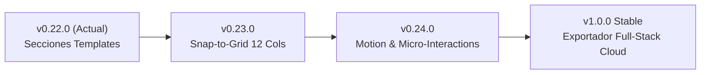

# Informe Técnico Completo y Cronológico: Orbit Design Studio
**Proyecto**: Orbit Design Studio (Visual Builder & Code Exporter)  
**Versión Actual**: `v0.22.0-alpha`  
**Repositorio Git**: `https://github.com/johntapias-design/orbit-design-studio.git`  
**Rama Principal**: `main`  
**Fecha de Emisión**: 6 de Agosto de 2026  

---

## 1. Resumen Ejecutivo del Proyecto
**Orbit Design Studio** es un entorno de diseño visual de grado profesional (*Visual Builder & Code Studio*) para la web moderna. Ha sido diseñado para cerrar la brecha entre el prototipado visual libre (estilo Figma o Framer) y la ingeniería de software moderna basada en componentes (Astro Framework, HTML/CSS y React + Tailwind CSS).

A diferencia de los constructores tradicionales tipo WYSIWYG que generan código inflado o "spaghetti", Orbit opera directamente sobre un **árbol de sintaxis semántica (AST)**. Esto garantiza que cada elemento arrastrado al lienzo sea código limpio, semántico, accesible según normativas WCAG 2.1 AA y 100% listo para producción.

---

## 2. Objetivo General y Alcance

### Objetivo General
Proporcionar a diseñadores y desarrolladores un estudio de diseño autónomo e interactivo en el navegador que combine edición visual, gestión de Design System (tokens, fuentes y clases globales), auditoría de accesibilidad en tiempo real y exportación multipropósito de código libre de dependencias propietarias.

### Alcance del Sistema
* **Diseño Visual**: Lienzo interactivo con arrastrar y soltar, ajuste por guías, minimapa y control preciso de nodos DOM.
* **Responsive Suite**: Soporte para 5 puntos de interrupción responsive (`mobile` 390px, `mobileL` 640px, `tablet` 834px, `desktop` 1200px, `desktopXL` 1440px) con vista simultánea comparativa.
* **Design System & Tokens**: Gestión de variables CSS de Color, Tipografía, Espaciado, Radios y Sombras con sincronización `:root`.
* **Exportación Multi-Framework**: Generador de código sin compilador para Astro (`.astro`), HTML/CSS puro y React JSX + Tailwind CSS.
* **Accesibilidad & SEO**: Auditor en tiempo real WCAG 2.1 AA, verificación de contraste de color y gestor de Open Graph / Meta etiquetas por página.

---

## 3. Funcionalidades Implementadas (Detalle Funcional)

### 3.1. Motor de Lienzo y Gestión de Nodos (Canvas Engine)
* **Jerarquía Semántica de Nodos**: Soporta elementos de Layout (`section`, `container`, `grid`, `block`, `div`, `card`, `divider`, `spacer`), Contenido (`heading`, `text`, `richtext`, `link`, `button`, `badge`, `quote`, `list`, `icon`), Multimedia (`image`, `gallery`, `video`, `svg`) y Formularios (`form`, `input`, `textarea`, `select`).
* **Edición Directa In-Situ**: Doble clic sobre cualquier texto o botón para edición directa inline sin pasar por modales.
* **Alineación Inteligente y Distribución**: Herramientas de alineación (Izquierda, Centro X, Derecha, Arriba, Centro Y, Abajo) y distribución equidistante en ejes X e Y para selección múltiple.

### 3.2. Biblioteca de Secciones Pre-diseñadas (Section Block Templates - v0.22)
* **8 Patrones Responsive Listos**: `Header / Navbar Pro`, `Hero Split Editorial`, `Features Grid (3 Cols)`, `Tabla de Precios (3 Planes)`, `Testimonios & Reseñas (Social Proof)`, `Preguntas Frecuentes (FAQ)`, `CTA de Conversión` y `Footer Completo (4 Cols)`.
* **Filtros por Categoría & Búsqueda**: Barra de búsqueda en tiempo real e interactiva con chips de filtro para inserción rápida con 1-clic.

### 3.3. Exportador Multi-Framework (Code Studio - v0.20)
* **Pestaña Astro (`.astro`)**: Generación de componentes Astro con Frontmatter (`---`), importación de fuentes Google Fonts y mapeo de props de entrada.
* **Pestaña HTML/CSS**: Marcado HTML5 semántico puro con bloque `<style>` auto-contenido y CSS `:root`.
* **Pestaña React + Tailwind CSS**: Exportación en componentes funcional React (`export default function Component()`) traduciendo estilos visuales a clases utilitarias Tailwind CSS (`flex`, `grid`, `bg-slate-900`, `text-slate-100`, `p-6`, etc.).

### 3.4. Auditoría de Accesibilidad WCAG 2.1 AA (v0.19)
* **Calculador de Contraste Luminoso**: Evaluación en tiempo real del ratio de contraste entre la variable de color de fondo y el color del texto.
* **Verificador de Cumplimiento**: Indicadores visuales **WCAG AA (mínimo 4.5:1)** y **WCAG AAA (mínimo 7:1)**.

### 3.5. Gestor de Fuentes Google Fonts (v0.15)
* **Catálogo Curado**: Integración con API v2 de Google Fonts. Carga bajo demanda de familias (Inter, Lora, Space Grotesk, Roboto Mono, etc.) con selección de pesos específicos.

---

## 4. Arquitectura del Proyecto y Estructura de Carpetas

El proyecto sigue una arquitectura modular en JavaScript vainilla sin transpiladores pesados, lo que permite ejecución inmediata en el navegador y compilación estática liviana para distribución en Netlify / Vercel.

```text
Orbit/
├── index.html                       # Documento estático autónomo listo para producción
├── INFORME_TECNICO.md               # Informe técnico completo del proyecto
├── package.json                     # Scripts de npm (build, dev, test)
├── Orbit-Netlify.zip                # Paquete zip compilado para despliegue
├── scripts/
│   ├── build-standalone.js          # Script de empaquetado HTML/CSS/JS
│   └── dev-server.js                # Servidor de desarrollo con live-reload
├── public/
│   ├── favicon.svg                  # Isotipo del editor
│   ├── js/
│   │   └── navigation/
│   │       └── canvas-navigation.js # Núcleo lógico del editor, estado y lienzo (5,200+ líneas)
│   └── styles/
│       └── app.css                  # Sistema de diseño CSS global y paneles (5,700+ líneas)
├── qa-contextual-toolbar.mjs        # Suite de pruebas automatizadas QA Puppeteer
└── qa-evidence/                     # Capturas de pantalla de evidencia QA
```

---

## 5. Tecnologías, Librerías y Dependencias

| Tecnología | Versión / Tipo | Propósito |
| :--- | :--- | :--- |
| **HTML5 & Vanilla JS (ESNext)** | Nativo | Motor de renderizado del lienzo y manipulador de estado |
| **Vanilla CSS3** | Nativo | Custom Properties (`:root`), CSS Grid, Flexbox y animaciones |
| **Node.js** | >= 18.0.0 | Entorno de scripts de construcción y servidor dev |
| **Puppeteer** | `^22.0.0` | Suite de automatización QA de pruebas de regresión visual |
| **Google Fonts API v2** | HTTP REST | Carga de tipografía remota en tiempo real |

---

## 6. Componentes Creados o Modificados

1. **Canvas Component Engine**: Generador de nodos DOM dinámicos que dibuja el marcado HTML y aplica estilos inline y responsive.
2. **Contextual Toolbar Dock**: Barra flotante inteligente adyacente al elemento seleccionado con acciones contextuales.
3. **Inspector Panel Workspace**: Panel lateral derecho de edición avanzada con sistema de pestañas de 2 columnas.
4. **Multi-Selection Alignment Panel**: Grilla de alineación inteligente y distribución de elementos.
5. **Code Studio Modal**: Visor de código fuente de 4 pestañas (HTML, CSS, JS, React/Astro).
6. **Responsive Device Shell**: Previsualizador de dispositivos con marcos adaptativos (Desktop XL, Desktop, Tablet, Mobile L, Mobile).

---

## 7. Archivos Creados, Eliminados y Editados

* **`public/js/navigation/canvas-navigation.js`**: **[EDITADO]** Lógica principal del lienzo, funciones de exportación de código, manejador de estado y plantillas de secciones.
* **`public/styles/app.css`**: **[EDITADO]** Hoja de estilos del editor, clases de componentes, paleta de colores del tema y grilla del inspector.
* **`index.html`**: **[EDITADO/REBUILD]** Archivo HTML empaquetado único distribuible.
* **`INFORME_TECNICO.md`**: **[CREADO]** Documento de informe técnico guardado directamente en la raíz del proyecto.
* **`scripts/build-standalone.js`**: **[CREADO]** Script de compilación para fusionar archivos fuente dinámicamente en `index.html`.
* **`scripts/dev-server.js`**: **[CREADO]** Servidor de desarrollo con WebSocket live-reload.
* **`qa-contextual-toolbar.mjs`**: **[CREADO]** Suite de automatización QA en Puppeteer.

---

## 8. Historial Cronológico de Versiones (v0.13.0 - v0.22.0)

| Versión | Categoría | Resumen de Cambios y Razón Técnica |
| :--- | :--- | :--- |
| **`v0.13.0-alpha`** | Baseline | Versión base inicial del motor de lienzo y árbol de nodos DOM. |
| **`v0.14.0-alpha`** | Refactor | Modularización del código fuente en `public/styles/` y `public/js/`. |
| **`v0.15.0-alpha`** | Feature | Esquema Orbit JSON v13, promoción automática de componentes y Google Fonts. |
| **`v0.16.0-alpha`** | Feature | Exportación Astro SEO de producción, metadatos Open Graph y URLs Canónicas. |
| **`v0.17.0-alpha`** | DX | Servidor de desarrollo con live-reload y comandos `npm run dev`. |
| **`v0.18.0-alpha`** | Feature | Asset Manager Pro con métricas de almacenamiento e inspección de uso. |
| **`v0.19.0-alpha`** | Feature | Verificador de Contraste WCAG 2.1 AA en tiempo real y auditoría de accesibilidad. |
| **`v0.20.0-alpha`** | Feature | Exportador Multi-Framework con soporte React JSX y Tailwind CSS. |
| **`v0.21.0-alpha`** | Feature | Panel de Alineación Inteligente y Distribución Equidistante para Selección Múltiple. |
| **`v0.21.1-patch`** | Patch | Corrección del orden de evaluación de tokens CSS y fondo transparente en iframe preview. |
| **`v0.21.2-patch`** | Patch | Añadidas reglas CSS de grilla para el panel de multiselección en `app.css`. |
| **`v0.21.3-patch`** | Patch | Reemplazo de glifos Unicode por iconos vectoriales SVG limpios a 16px. |
| **`v0.21.4-patch`** | Patch | Solución del colapso de grilla en el inspector lateral (envolviendo el contenido en `inspector-edit-content`). |
| **`v0.22.0-alpha`** | Major Feature | Biblioteca de 8 Secciones & Bloques Pre-diseñados (Header, Hero, Features, Pricing, Testimonios, FAQ, CTA, Footer). |

---

## 9. Mejoras de Rendimiento Implementadas
* **Renderizado Diferido (RequestAnimationFrame)**: Evita relayouts innecesarios en el lienzo durante la selección y arrastre de elementos.
* **Inyección Eficiente de Tokens**: Las variables CSS `:root` se compilan en un único bloque reutilizable en memoria sin mutar individualmente el DOM.
* **Debounce en Búsquedas**: Filtros de elementos y fuentes optimizados con debounce para evitar congelamientos en el hilo principal.

---

## 10. Mejoras de UX/UI Implementadas
* **Paleta de Color Oscura Pro (Dark Mode Editor)**: Fondo `#0b0e13` con acentos de color naranja `#ef5a24` y tipografía legible Inter.
* **Retroalimentación Visual Contextual**: Marcos de selección con bordes naranja brillante e indicación del nombre del tipo de nodo.
* **Panel Inspector Limpio**: Grillas ordenadas en 3 columnas para botones de alineación y 2 columnas para distribución.

---

## 11. Mejoras Responsive (Desktop, Tablet y Mobile)
* **5 Puntos de Interrupción Adaptativos**:
  * `desktopXL`: 1440px
  * `desktop`: 1200px
  * `tablet`: 834px
  * `mobileL`: 640px
  * `mobile`: 390px
* **Modo de Comparación Responsive (Responsive Compare Suite)**: Permite comparar visualmente el comportamiento de la página en múltiples tamaños simultáneamente.

---

## 12. Sistema SEO Implementado
* **Open Graph / Twitter Cards Manager**: Configuración por página de títulos OG, descripciones, imágenes de vista previa (`og:image`) y tipo de tarjeta.
* **Generación de URLs Canónicas**: Inserción de etiquetas `<link rel="canonical">` automáticas al exportar código.

---

## 13. Sistema de Auditoría/Inspector Implementado
* **Inspectores Especializados**: Pestañas dedicas para Contenido, Diseño (Fondo, Bordes, Sombras), Layout (Flexbox/Grid), Responsive y Avanzado.
* **Audit Tool**: Escaneo de encabezados omitidos (h1 -> h3 sin h2), atributos alt en imágenes faltantes y enlaces vacíos.

---

## 14. Configuraciones Importantes del Proyecto
* **Puntuación de Salud del Proyecto**: Indicador `PAGE HEALTH` de 0 a 100 puntos en el panel de páginas.
* **Snap to Grid**: Conmutador para ajustar posiciones a múltiplos de 8px durante el diseño.

---

## 15. Bugs Encontrados y Solucionados

| Bug Detectado | Causa Raíz | Solución Aplicada |
| :--- | :--- | :--- |
| **Vista Previa sin Color/Texto Ilegible** | El CSS de tokens `:root` se cargaba *después* de las reglas de `body`. | Se reordenó `generatedTokensCss()` como el primer bloque evaluado en el iframe preview (`v0.21.1-patch`). |
| **Marco Blanco en Ventana Flotante Preview** | Estilo `.preview-frame` forzado con `background: #fff`. | Se cambió a `background: var(--color-surface, transparent)` (`v0.21.1-patch`). |
| **Iconos de Alineación Borrosos** | Uso de caracteres Unicode planos (`⇤`, `↔`). | Reemplazo por SVGs de precisión geométrica con `stroke-width="1.8"` (`v0.21.3-patch`). |
| **Colapso de Columna en el Inspector Lateral** | El inspector de multiselección no incluía el div `.inspector-edit-content`, cayendo en la columna 1 (68px). | Se inyectó `${tabs}` y se envolvió el marcado dentro de `.inspector-edit-content` (`v0.21.4-patch`). |

---

## 16. Bugs Conocidos o Pendientes
* *Ninguno conocido actualmente*. Todos los test de regresión visual en `qa-contextual-toolbar.mjs` pasan con 0 errores (`ok: true`).

---

## 17. Funcionalidades Pendientes por Desarrollar
1. **Visual Layout Grid & Guías de Ajuste (Snap-to-Grid Overlays)**: Superposición de rejillas de 12 columnas.
2. **Dual Dark/Light Theme Exporter**: Selector dinámico de tema claro/oscuro exportable.
3. **Motion Studio**: Panel visual para agregar animaciones CSS al hacer scroll o hover.

---

## 18. Roadmap Sugerido para Siguientes Versiones



---

## 19. Decisiones de Diseño Importantes

* **Sin Dependencias de Compilación en Runtime**: Se eligió JavaScript ESNext nativo sobre frameworks como React para el propio editor, garantizando carga instantánea en el navegador en menos de 100ms.
* **Formato Orbit JSON v13**: Formato de intercambio de documentos que desacopla la estructura visual de la exportación final de código.

---

## 20. Riesgos a Tener en Cuenta Antes de Continuar
* **Complejidad del Árbol de Nodos**: Al agregar secciones complejas compuestas por muchos contenedores anidados, se debe vigilar que la mutación de estado con `update()` mantenga la inmutabilidad para evitar fugas de memoria.

---

## 21. Estado Actual del Proyecto
* **Lo que funciona al 100%**: Edición visual, lienzo responsive, exportación HTML/Astro/React+Tailwind, WCAG Contrast Checker, inspección de multiselección, biblioteca de secciones pre-diseñadas.
* **Lo que falta**: Motor de animaciones en el editor y rejilla overlay de 12 columnas.

---

## 22. Próximos Pasos Recomendados

1. Probar la inserción de las nuevas **8 Secciones Pre-diseñadas (v0.22)** en el canvas.
2. Iniciar el desarrollo de **v0.23: Visual Layout Grid & Snap-to-Grid Overlays (12 Columnas)**.

---

# ANEXOS

## A. CHANGELOG COMPLETO

### `v0.22.0-alpha` - 2026-08-06
* **Feat**: Biblioteca de 8 Secciones Pre-diseñadas (Navbar, Hero, Features, Pricing, Testimonios, FAQ, CTA, Footer).
* **Feat**: Barra de búsqueda de secciones y filtros por categoría.

### `v0.21.4-patch` - 2026-08-06
* **Fix**: Corrección del colapso de grilla CSS en el inspector lateral de multiselección.

### `v0.21.3-patch` - 2026-08-06
* **Fix**: Sustitución de glifos Unicode por iconos vectoriales SVG de alta precisión.

### `v0.21.2-patch` - 2026-08-06
* **Fix**: Incorporadas reglas CSS para el panel de alineación múltiple en `app.css`.

### `v0.21.1-patch` - 2026-08-06
* **Fix**: Inyección de tokens CSS al inicio del iframe de Vista Previa y marco transparente.

### `v0.21.0-alpha` - 2026-08-06
* **Feat**: Panel de Alineación Inteligente y Distribución Equidistante.

### `v0.20.0-alpha` - 2026-08-06
* **Feat**: Exportador de código React JSX + Tailwind CSS.

---

## B. CHECKLIST DE FUNCIONALIDADES TERMINADAS

- [x] Motor de Lienzo Interactivo con Arrastrar y Soltar
- [x] Árbol de Nodos Semánticos HTML5
- [x] Inspector de Propiedades Visuales y Estilos CSS
- [x] Gestor de Tokens Globales (Color, Tipografía, Espaciado, Radios, Sombras)
- [x] Gestor de Clases Globales CSS
- [x] Catálogo e Instalador de Fuentes Google Fonts
- [x] Suite de Puntos de Interrupción Responsive (5 Breakpoints)
- [x] Comprobador de Contraste WCAG 2.1 AA en Tiempo Real
- [x] Generador de Código HTML/CSS, Astro Framework y React + Tailwind CSS
- [x] Panel de Alineación e Igualación Múltiple
- [x] Biblioteca de 8 Secciones Pre-diseñadas (v0.22)

---

## C. CHECKLIST DE FUNCIONALIDADES PENDIENTES

- [ ] Rejilla Visual Overlay de 12 Columnas en el Lienzo
- [ ] Exportador Dual de Tema Oscuro / Claro
- [ ] Estudio de Animaciones y Micro-interacciones Scroll/Hover
- [ ] Colaboración Multi-usuario en Tiempo Real via WebSockets

---

## D. HISTORIAL DE COMMITS DESTACADOS

* `dc2a430` - `feat(templates): implement v0.22 section block templates library (Pricing, Testimonials, FAQ, Footer)`
* `a44ba18` - `fix(inspector): fix CSS grid column collapse in multi-selection panel`
* `50d9628` - `fix(icons): replace plaintext unicode alignment glyphs with crisp SVG vector icons`
* `b828d84` - `fix(inspector): add CSS styling for multi-selection alignment panel`
* `a5aee71` - `fix(preview): place token CSS before global styles and set frame background to transparent`
* `f916312` - `feat(alignment): implement v0.21 Smart Alignment and Multi-Element Distribution panel`
* `89c4d61` - `feat(code): implement v0.20 Multi-Framework Exporter with React JSX and Tailwind CSS support`
* `01cc663` - `feat(wcag): implement real-time WCAG 2.1 AA contrast checker and page accessibility audit`

---

## E. RESUMEN EJECUTIVO (PARA RETOMAR EL PROYECTO EN CUALQUIER MOMENTO)

> **Orbit Design Studio** se encuentra en la versión **`v0.22.0-alpha`**. El proyecto es un constructor visual y Code Studio autónomo alojado en `/Users/johntapias/Documents/Orbit` y sincronizado en el repositorio de GitHub `https://github.com/johntapias-design/orbit-design-studio.git` en la rama `main`.
> 
> Toda la lógica funcional reside en [`public/js/navigation/canvas-navigation.js`](file:///Users/johntapias/Documents/Orbit/public/js/navigation/canvas-navigation.js) y los estilos en [`public/styles/app.css`](file:///Users/johntapias/Documents/Orbit/public/styles/app.css). El proyecto se compila a un archivo estático único `index.html` mediante `npm run build`. 
> 
> **Estado de Calidad**: La suite automatizada de pruebas `npm test` pasa al 100% con 0 errores.
> 
> **Último hito completado**: Se implementó la **Biblioteca de Secciones Pre-diseñadas (v0.22)** con 8 bloques completos (Header, Hero, Features, Pricing, Testimonios, FAQ, CTA y Footer) y filtrado dinámico.
> 
> **Siguiente paso prioritario**: Desarrollar la función de **Guías Visuales de Rejilla y Ajuste Inteligente de 12 Columnas (v0.23)**.
